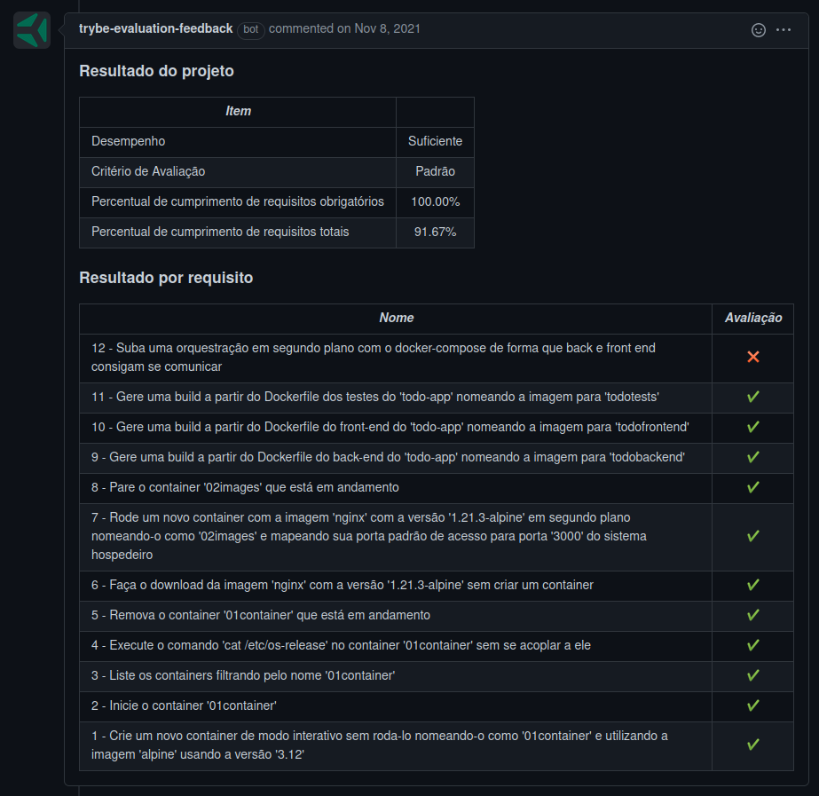

# Welcome to the Docker To Do List

## Context

This project was made as a work assignment in during the Trybe web developer course.

The goal was to utilize our learnings in docker to build a container of this application using docker files and docker compose.

---

## How to install

For this project, you will need to have installed:
- NPM
- DOCKER

Copy the ssh from the project `git@github.com:luciobj/Project-Docker-To-Do-List.git`

* Open a terminal int your machine and type the following commands in order:

  * `git clone git@github.com:luciobj/Project-Docker-To-Do-List.git`
  * `cd Project-Docker-To-Do-List/docker`
  * `docker-compose up -d`

---

### Technologies

In this project the focus was solely on docker build, but the app also uses React and CSS styling for frontend, and NPM for the backend.

---

## Evaluator Results

This is a screenshot of the last run of the Trybe evaluator, which scores the demands of the project.

